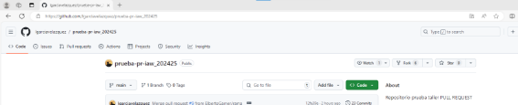
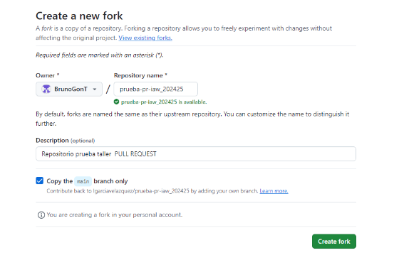
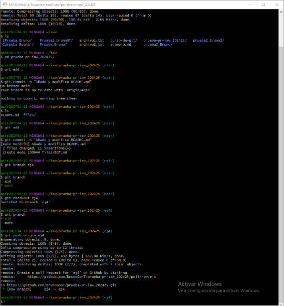

# Ejercicio 4: Git. Colaborar en un proyecto de software libre. Pull Request (PR)

 
## Hacer el fork
 
> Para hacer el fork vamos a tener que ir al repositorio que queremos hacer el fork, al lado del boton *unwatch* tenemos el boton *Fork*, este boton nos llevara a la página para crearlo. Directamente le daremos en **Create fork**
 

 

## Clonar la prueba IAW
 
> Dentro de mi carpeta principal he clonado mi repositorio, luego entré con **cd** dentro del repositorio clonado. Antes de hacer nada fuí a *Visual code* para crear un nuevo markdown y dentro de README.md puse la ruta para encontrarlo.
 
> Cuando todo eso está hecho hare un **git add .** y **git commit -m** para añadir los cambios y confirmarlos.
 

 
## Subir la prueba IAW y hacer el request
`Esta parte del ejercicio se hizo directamente y no se pudo tomar capturas del proceso, solo los comandos usados`
 
> Con el commit hecho y los archivos ya modificados hago un ** git branch ejer4 ** para trabajar en mi propia rama y no tener problemas, entro en la rama de ejer4 con **git checkout** y dentro hago **git push origin ejer4** que empujará los nuevos cambios y creará la request.
 